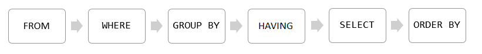
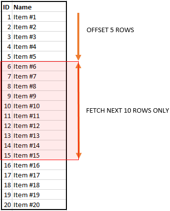
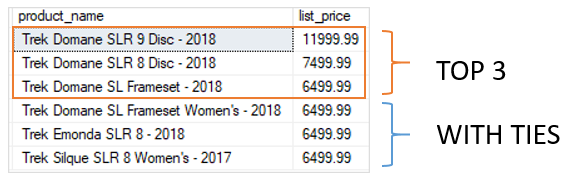

# SQL SERVER BASICS part-1

In this class we'll cover following topics
- Querying Data
- Sorting Data
- Limiting Data

## SECTION-01: QUERYING DATA

This section helps you learn how to query data from the SQL Server database. We will start with a simple query that allows you to retrieve data from a single table.

`SELECT` – show you how to query data against a single table.

```sql
-- syntax
SELECT
select_list
FROM
schema_name.table_name;
```
Examples:

```sql
-- examples
SELECT first_name FROM sales.customers; -- FROM >> SELECT
SELECT first_name, last_name FROM sales.customers;
SELECT * FROM sales.customers;
SELECT * FROM sales.customers WHERE state = 'CA'; -- FROM >> WHERE >> SELECT
SELECT * FROM sales.customers WHERE state = 'CA' ORDER BY first_name; -- FROM >> WHERE >> SELECT >> ORDER BY
SELECT * FROM sales.customers WHERE state = 'CA' GROUP BY city ORDER BY city; -- FROM >> WHERE >> GROUP BY >> SELECT >> ORDER BY
SELECT city, count(*) FROM sales.customers WHERE state = 'CA' GROUP BY city HAVING count(*) > 10 ORDER BY city; 
SELECT city, count(*) AS cnt FROM sales.customers WHERE state = 'CA' GROUP BY city HAVING cnt > 10 ORDER BY city;
```

In last example, SQL Server processes the clauses in the following sequence: `FROM`, `WHERE`, `GROUP BY`, `HAVING`, `SELECT`, and `ORDER BY`.



## SECTION-02: SORTING DATA

This section helps you learn how to sort the queried data from the SQL Server database.

`ORDER BY` – sort the result set based on values in a specified list of columns

```sql
-- syntax
SELECT
    select_list
FROM
    table_name
ORDER BY 
    column_name | expression [ASC | DESC ];
```
Examples:

```sql
-- examples
SELECT first_name, last_name FROM sales.customers ORDER BY first_name; -- ASC by defualt
SELECT first_name, last_name FROM sales.customers ORDER BY first_name DESC;
SELECT city, first_name, last_name FROM sales.customers ORDER BY city, first_name; -- ASC by defualt
SELECT city, first_name, last_name FROM sales.customers ORDER BY city DESC, first_name ASC;
SELECT city, first_name, last_name FROM sales.customers ORDER BY state; -- possible to order by column that is not in select
SELECT first_name, last_name FROM sales.customers ORDER BY LEN(first_name) DESC; -- Sort a result set by an expression i:e., LEN()
SELECT first_name, last_name FROM sales.customers ORDER BY 1, 2;
-- 1 means the first_name column, and 2 means the last_name column.
```

_NOTE:_
Using the ordinal positions of columns in the ORDER BY clause is considered a bad programming practice for a couple of reasons.
- First, the columns in a table don’t have ordinal positions and need to be referenced by name.
- Second, when you modify the select list, you may forget to make the corresponding changes in the ORDER BY clause.
Therefore, it is a good practice to always specify the column names explicitly in the ORDER BY clause.

## SECTION-03: LIMITING DATA

This section helps you learn how to limit data in the SQL Server using `OFFSET` `FETCH` and `TOP`.

- `OFFSET FETCH` – limit the number of rows returned by a query.
- `SELECT TOP` – limit the number of rows or percentage of rows returned in a query’s result set.

### => `OFFSET FETCH`

```sql
-- syntax
ORDER BY column_list [ASC |DESC]
OFFSET offset_row_count {ROW | ROWS} -- OFFSET clause specifies the number of rows to skip
FETCH {FIRST | NEXT} fetch_row_count {ROW | ROWS} ONLY -- FECTH is optional & FIRST/NEXT are optional
```

_NOTE:_
- The `OFFSET` and `FETCH` clauses are the options of the `ORDER BY` clause.
- The following illustrates the OFFSET and FETCH clauses:



```sql
-- examples
SELECT product_name, list_price FROM production.products ORDER BY list_price, product_name; -- NOTE above point # 01
SELECT product_name, list_price FROM production.products ORDER BY list_price, product_name OFFSET 10 ROWS; -- skip first 10 rows
SELECT product_name, list_price FROM production.products ORDER BY list_price, product_name OFFSET 10 ROWS FECTH NEXT 10 ROWS; -- skip first 10 & select next next 10 rows
SELECT product_name, list_price FROM production.products ORDER BY list_price, product_name OFFSET 0 ROWS FECTH NEXT 10 ROWS; -- select first 10 rows
```

### => SELECT `TOP`

```sql
-- syntax
SELECT TOP (expression) [PERCENT]
    [WITH TIES]
FROM 
    table_name
ORDER BY 
    column_name;
```

```sql
-- examples
SELECT TOP 10 product_name, list_price FROM production.products ORDER BY list_price DESC; -- top 10 most expensive products
SELECT TOP 1 PERCENT product_name, list_price FROM production.products ORDER BY list_price DESC; -- total_rows=321, 1%=3.21 ~ 4rows
SELECT TOP 3 WITH TIES  product_name, list_price FROM production.products ORDER BY list_price DESC; -- explained below
```
Example three is explained below:



In this example, the third expensive product has a list price of 6499.99. Because the statement uses TOP WITH TIES, it returns three more products whose list prices are the same as the third one.